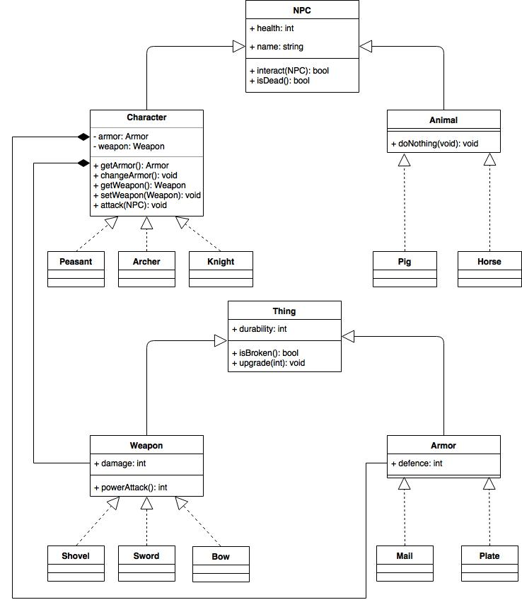

# Homework 3
Hierarchy of objects for a game on the theme of the Middle Ages. It provides classes for NPC(characters and animals),
items(armor and weapon).

## UML diagram


## Compile and run
```
make
```
It'll create instance of knight, which attacks a little peasant with his sword!
