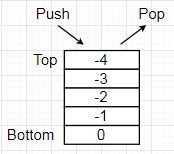

# Память в С++
### Кеш, оперативная память, стек и куча, выделение и освобождение памяти
---

#### Процессор


#### Важные константы
```
1 такт = 1 / частота процессора
1 / 3 GHz = 0.3 ns
                                             0.3 ns
L1 cache reference                           0.5 ns
Branch mispredict                            5   ns
```
> Неудачный if ()
```
L2 cache reference                           7   ns
Mutex lock/unlock                           25   ns
Main memory reference                      100   ns
```
> Кроме задержки (latency) есть понятие пропускной способности (throughput, bandwidth). В случае чтения из RAM - 10-50 Gb/sec
```
Compress 1K bytes with Zippy             3,000   ns
Send 1K bytes over 1 Gbps network       10,000   ns
Read 4K randomly from SSD              150,000   ns
Read 1 MB sequentially from memory     250,000   ns
Round trip within same datacenter      500,000   ns
Read 1 MB sequentially from SSD      1,000,000   ns
HDD seek                            10,000,000   ns
Read 1 MB sequentially from HDD     20,000,000   ns
Send packet CA->Netherlands->CA    150,000,000   ns
```
Источник: [https://gist.github.com/jboner/2841832](https://gist.github.com/jboner/2841832)

### Выводы из таблицы
1. Стараться укладывать данные в кеш
2. Минимизировать скачки по памяти
3. В условиях основной веткой делать ветку которая выполняется с большей вероятностью
4. В крайних случаях можно "разворачивать" циклы

## Компиляция и компоновка

1. Обработка препроцессором
2. Компиляция
3. Компоновка

### Препроцессор

##### Включение файла
```c++
#include <file_name> // Поиск в системных директориях
#include "file_name" // Поиск в текущей директории
```

##### Макроподстановки

```c++
#define true false // happy debugging
#define true !!(rand() % 2)
```

```c++
#define BUF_SIZE 1024
```

Не используйте define для определения констант, он игнорирует пространства имен и ничего не знает о типах.

###### Константы в С++

```c++
namespace options
{
    const size_t BufSize = 1024;
    constexpr size_t BufSize = 1024;
}
```

##### Условная компиляция

```c++
#define DEBUG
#ifdef DEBUG
    ...
#else
    ...
#endif
```
```
g++ -DDEBUG ...
```

##### Вывод сообщений
```c++
#ifdef BUF_SIZE
#error Rename the macros
#endif

#define BUF_SIZE 256

...

#undef BUF_SIZE
```

### Единица трансляции

Минимальный блок исходного текста, который можно преобразовать во внутреннее машинное представление.

```code.cpp```
```c++
#include <vector>

#include "code.h"

void someFunction()
{
    ...
}

...
```
> Исходный код code.cpp, плюс все включенные в него файлы – единица трансляции.

```
g++ –o code.o –c code.cpp
```
code.o – результат компиляции, объектный файл (object file).

>При изменении любого включенного заголовочного файла потребуется перекомпиляция единицы трансляции.

### Компоновка (linking)

Объектный файл может ссылаться на символы не определенные в нем.

Объектные файлы собираются в исполняемый файл или библиотеку компоновщиком, не определенные символы компоновщик ищет в других объектных файлах и производит их замену на корректные адреса.

```
g++ -o my_app a.o b.o
```

Компоновщик ld, но g++ сделает его вызов самостоятельно.

### Классы управления памятью и областью видимости в C++

Характеризуются тремя понятиями:
1. **Время жизни**
> Продолжительность хранения данных в памяти
2. **Область видимости**
> Части кода из которых можно получить доступ к данным
3. **Связывание (linkage)**
> Если к данным можно обратиться из другой единицы трансляции — связывание внешнее (external), иначе связывание внутреннее (internal)

#### Автоматический/регистровый (register)

| Время жизни | Область видимости | Связывание |
| --- | --- | --- |
| Автоматическое (блок) | Блок | Отсутствует |

```c++
{
	int i = 5;
}

if (true)
{
	register int j = 3;
}

for (int k = 0; k < 7; ++k)
{
}
```

#### Статический без связывания

| Время жизни | Область видимости | Связывание |
| --- | --- | --- |
| Статическое | Блок | Отсутствует |

```c++
void foo()
{
	static int j = 3;
}
```

> Инициализируется при первом обращении

#### Статический с внутренним связыванием

| Время жизни | Область видимости | Связывание |
| --- | --- | --- |
| Статическое | Файл | Внутреннее |

```c++
static int i = 5;
```

> Инициализируется до входа в main

#### Статический с внешним связыванием

| Время жизни | Область видимости | Связывание |
| --- | --- | --- |
| Статическое | Файл | Внешнее |

```c++
// *.cpp
int i = 0;
```
```c++
// *.h
extern int i;
```

### Типы памяти

#### Стек (Stack)


```c++
int i = 5;
std::string name;
char data[5];
```
> Выделение памяти на стеке очень быстрая, но стек не резиновый

#### Куча (Heap)

```c++
int* i = (int*) malloc(sizeof(int));
std::string* name = new std::string();
char* data = new char[5];
...
free(i);
delete(name);
delete[] data;
```
Память в куче выделяют new и malloc, есть сторонние менеджеры памяти.

Основное:
- new то же, что и malloc, только дополнительно вызывает конструкторы
- Внутри malloc есть буфер, если в буфере есть место, ваш вызов может выполниться быстро
- Если памяти в буфере нет, будет запрошена память у ОС (sbrk, VirtualAlloc) - это дорого
- ОС выделяет память страницами от 4Кб, а может быть и все 2Мб
- Стандартные аллокаторы универсальные, то есть должны быть потокобезопасны, быть одинаково эффективны для блоков разной длины, и 10 байт и 100Мб. Плата за универсальность - быстродействие

#### Глобальная память (data segment)

```c++
static const int i = 5;
static std::string name;
extern char data[5];
```
> Если не удастся разместить блок глобальной памяти, то программа даже не запустится

### Арифметика указателей
Указатель - адрес ячейки памяти.

sizeof - размер типа в байтах
> C++ не дает гарантий на точный размер int, long и т.д. В кроссплатформенном коде надо использовать int32_t, uint64_t и т.д.
```c++
int x = 5;
int* i = &v; // & - взятие адреса
int y = *i; // * - разыменование указателя
```
```c++
++i;
```
Фактически:
```c++
ptr = (char*) i;
ptr = ptr + sizeof(int);
i = (int*) ptr;
```
```c++
i += 5;
```
Фактически:
```c++
ptr = (char*) i;
ptr = ptr + 5 * sizeof(int);
i = (int*) ptr;
```
> C-cast использовать в С++ нельзя! Как надо приводить типы в С++ и надо ли вообще будет в другой лекции

Для указателя ни на что не ссылающегося следует использовать nullptr

Разность указателей:
```c++
ptrdiff_t delta = ptr1 - ptr2;
```

### Массивы
```c++
T array[maxColumns];
T value = array[x];
```
> Значение в квадратных скобках должно быть известно на этапе компиляции, увы
```c++
int data[] = { 1, 2, 3 };
int i = data[2];
```
Фактически - это вычисление смещения:
```c++
ptr = data;
ptr = ptr + 2 * sizeof(int);
i = *ptr;
```
Массив - непрерывный блок байт в памяти, sizeof(data) вернет размер массива в байтах (не элементах!). Размер массива в элементах можно вычислить: sizeof(data) / sizeof(data[0])
```c++
int* data = new int[10];
int i = data[2];
delete[] data;
```
##### Массив <-> указатель
```c++
int i[] = { 1, 2, 3 };
int* j = i;
using array = int(*)[3];
array k = (array) j;
```

### Двумерные массивы
```c++
T array[maxRows][maxColumns];
T value = array[y][x];
```
```c++
int data[][2] = { { 1, 2 },  { 3, 4 }, { 5, 6 } };
int i = data[2][1];
```
Фактически:
```c++
ptr = data;
ptr = ptr + maxColumns * sizeof(int) * 2 + 1;
i = *ptr;
```
##### Массив <-> указатель
```c++
int i[][2] = { { 1, 2 }, { 3, 4 }, { 5, 6 } };
int* j = (int*) i;
using array = int(*)[3][2];
array k = (array) j;
```

### Ссылки

Ссылка - псевдоним объекта.

Главное отличие от указателя - ссылка должна быть проинициализированна при объявлении и до конца своей жизни ссылается только на один объект!

```c++
int a = 1;
int b = 2;
int* ptr = nullptr;
ptr = &a;
ptr = &b;
int& ref; // Ошибка
int& ref = a;
a = b; // Ошибка
```
```c++
int a = 2;
int* ptr = nullptr;
int*& ptrRef = ptr;
ptrRef = &a;
```

### Измеряем скорость работы (benchmark)

1. Измерений должно быть много
2. Одному прогону верить нельзя
3. Компилятор оптимизирует, надо ему мешать
4. Перед тестами надо греться

##### Пример "вредной" оптимизации
```c++
int main()
{
    Timer t;
    for (int i = 0; i < 100 * 1000 * 1000; ++i)
        int a = i / 3;
    return 0;
}
```

##### Не даем компилятору оптимизировать
```c++
int main()
{
    Timer t;
    for (int i = 0; i < 100 * 1000 * 1000; ++i)
        volatile int a = i / 3;
    return 0;
}
```

### Класс Timer
```c++
#include <chrono>
#include <iostream>

class Timer
{
public:
    Timer()
        : start_(std::chrono::high_resolution_clock::now())
    {
    }

    ~Timer()
    {
        const auto finish = std::chrono::high_resolution_clock::now();
        std::cout << std::chrono::duration_cast<std::chrono::microseconds>(finish - start_).count() << " us" << std::endl;
    }

private:
    const std::chrono::high_resolution_clock::time_point start_;
};
```

### Практическая часть

Написать две программы суммирующие элементы двумерного массива (матрицы) целых чисел. Одна программа суммирует по столбцам, вторая по строкам. Измерить время работы в обоих случаях, сравнить результаты. Для замеров можно использовать класс Timer. В репозитории в директории homework создать директорию со своей фамилией, внутри этой директории создать директорию 01, файлы с решением положить внутрь. Программа должна собираться из консоли одной командой, например, так:
```
g++ sum_by_rows.cpp -o sum_by_rows --std=c++11 -O2
```

Оба решения можно запустить через valgrind и посмотреть количество промахов в кеш:
```
valgrind --tool=cachegrind your_program
```

Подумать.


##### После выполнения работы, проверяем, что код собирается, только после этого пишем Владиславу, что задание выполнено, тема письма должна быть msu_work_01

##### Владислав Смирнов <vladislav.smirnov@corp.mail.ru>

##### Сервис проверки: [http://homework.trempoltsev.ru](http://homework.trempoltsev.ru) (Для первого ДЗ не очень атуален, только проверить компиляцию)


EOF