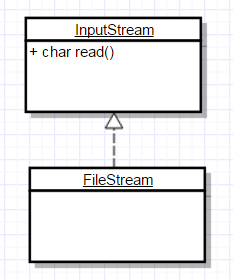

# Агрегация данных

Информация о пользователе:
1. Имя
2. Дата рождения
3. email

##### Без агрегации
```c++
std::string name;
time_t birthDate;
std::string email;
```
##### Агрегируем данные
```c++
struct UserInfo
{
    std::string name;
    time_t birthDate;
    std::string email;
};
```
##### Много пользователей (array of structs)
```c++
UserInfo users[];
```
##### Много пользователей (struct of arrays)
```c++
struct UserInfo
{
    std::string name[];
    time_t birthDate[];
    std::string email[];
};
```
### Класс
Описание сущности и правила взаимодействия с ней.

### Объект (экземпляр класса)
Сущность в адресном пространстве компьютера, появляющаяся
при создании класса.

### struct vs class
В С++ struct от class отличаются только модификатором доступа по-умолчанию. По-умолчанию содержимое struct доступно извне (public), а содержимое class - нет (private).

### Поле класса
Переменная связанная с классом или объектом.

### Интерфейс класса
Методы класса, доступные для использования другими классами представляют его интерфейс.

### Модификаторы доступа
```c++
class A
{
public:
    int x; // Доступно всем
protected:
    int y; // Наследникам и объектам класса
private:
    int z; // Только объектам класса
};
```

### Функции внутри классов
Функции внутри классов называются методами.
```c
struct File
{
    int descriptor;
    char* fileName;
    char buffer[BufferSize];
};

File* openFile(char* fileName)
{
    File* file = (File*) malloc(sizeof(File));
    file->descriptor = open(fileName, O_CREAT);
    ...
    return file;
}

void write(File* file, char* data, size_t size)
{
    ...
}

void close(File* file)
{
    close(file->descriptor);
    free(file);
}

File* file = openFile("...");
write(file, data, size);
close(file);
```
```c++
class File
{
public:
    File(const std::string& fileName)
    {
        ...
    }
    
    void write(const char* data, size_t size)
    {
        ...
    }
    
    ~File()
    {
        ...
    }
    
private:
    std::string fileName;
    int descriptor;
    char buffer[BufferSize];
};

File file("...");
file.write(data, size);
```

### Указатель на экземпляр класса
```c++
void write([File* this], const char* data, size_t size)
{
    this->descriptor ...
}
```

```c++
File* file = nullptr;
file->write(data, size);
```

### Константные методы
```c++
class Thermostat
{
public:
    using Celsius = double;
    
    void setTemperature(Celsius value)
    {
        temperature_ = value;
    }
    
    Celsius getTemperature() const
    {
        return temperature_;
    }
    
private:
    Celsius temperature_;
};
```
```c++
const Thermostat& getThermostat()
{
   ...
}

getThermostat().setTemperature(1000); // Ошибка!
getThermostat().getTemperature(); // Ok
```

### mutable
```c++
class Log
{
    void write(const std::string& text);
};

class Thermostat
{
public:
    using Celsius = double;
    
    Celsius getTemperature() const
    {
        log_.write("...");
        return temperature_;
    }
    
private:
    Celsius temperature_;
    Log log_;
};
```
```c++
class Thermostat
{
    mutable Log log_;
};
```

### Конструктор (ctor)
Служит для инициализации объекта.

Если конструктор не написан явно, С++ гарантирует, что будет создан конструктор по умолчанию.

### Деструктор (dtor)
Служит для деинициализации объекта, **гарантированно вызыватся при удалении объекта**.

Если деструктор не написан явно, С++ гарантирует, что будет создан деструктор по умолчанию.

### RAII (Resource Acquire Is Initialization)
Захват ресурса есть инициализация.

В конструкторе объект получает доступ к какому либо ресурсу (например, открывается файл), а при вызове деструктура этот ресурс освобождается (закрывается файл).

> Можно использовать не только для управления ресурсами

### Наследование
Возможность порождать класс на основе другого с сохранением всех свойств класса-предка.

Класс, от которого производится наследование, называется базовым, родительским или суперклассом. Новый класс – потомком, наследником, дочерним или производным классом.

```c++
class Shape
{
    int x;
    int y;
};

class Circle
    : public Shape
{
    int radius;
};
```

> Наследование моделирует отношение «является».

> Требуется для создания иерархичности – свойства реального мира.

### Композиция
```c++
class Car
{
    Engine engine;
    Wheels wheels[4];
};
```
> Композиция моделирует отношение «содержит/является частью»

### Агрегация

```c++
class Car
{
    Driver* driver_;
};
```

При агрегации класс не контролирует время жизни своей части.

### Унифицированный язык моделирования (Unified Modeling Language, UML)

UML – это открытый стандарт, использующий графические обозначения для создания абстрактной модели системы, называемой UML-моделью. UML был создан для определения, визуализации, проектирования и документирования, в основном, программных систем. UML не является языком программирования, но на основании UML-моделей возможна генерация кода.

### Диаграмма классов (Class diagram)

Статическая структурная диаграмма, описывающая структуру системы, демонстрирующая классы системы, их атрибуты, методы и зависимости между классами.

#### Классы

Видимость:

```
+ Публичный метод (public)
# Защищенный метод (protected)
- Приватный метод (private)
```


#### Ассоциация

Показывает, что объекты связаны, бывает однонаправленной и двунаправленной.


#### Композиция

Моделирует отношение «содержит/является частью».

При композиции класс явно контролирует время жизни своей составной части.


#### Агрегация

Моделирует отношение «содержит/является частью».

При агрегации класс не контролирует время жизни своей части.


#### Наследование

Моделирует отношение «является».


#### Реализация



# Конструирование объекта
Порядок конструирования:
1. Выделяется память под объект
2. Инициализируются поля класса в том порядке, в котором они объявлены в классе
3. Происходит вызов конструктора
4. Если есть базовые классы, то конструирование начинается с них в порядке их очередности в списке наследования

```c++
class A
{
public:
    A() {} // 3
    ~A() {}

private:
    int x; // 1
    int y; // 2
};

class B
    : public A
{
public:
    B() {} // 5
    ~B() {}

private:
    int z; // 4
};
```

Порядок уничтожения:
1. Происходит вызов деструктора
2. Вызываются деструкторы для полей класса порядке обратном их объявлению в классе
3. Уничтожаются базовые классы в порядке обратном списку наследования

```c++
class A
{
public:
    A() {}
    ~A() {} // 3

private:
    int x; // 5
    int y; // 4
};

class B
    : public A
{
public:
    B() {}
    ~B() {} // 1

private:
    int z; // 2
};
```

### Списки инициализации
```c++
class A
{
    A()
        : x(5)
        , y(6)
    {
        z = 7;
    }
    
    int x;
    int y;
    int z;
};
```

Распространенная ошибка:
```c++
class A
{
    A()
        : y(5) // Инициализация в порядке объявления в классе!
        , x(y)
    {
    }
    
    int x;
    int y;
};
```

### Инициализация в объявлении
```c++
class A
{
    int x = 3;
};
```

# Простые типы (POD, Plain Old Data)

1. Скалярные типы (bool, числа, указатели, перечисления (enum), nullptr_t)
2. class или struct которые:
    - Имеют только тривиальные (сгенерированные компилятором) конструктор, деструктор, конструктор копирования
    - Нет виртуальных функций и базового класса
    - Все нестатические поля с модификатором доступа public
    - Не содержит статических полей не POD типа

#### Особенности:
1. Предсказуемое размещение в памяти
2. Отсутствие управляющего кода

### Примеры

```c+ +
class NotPOD
{
public:
    NotPOD(int x)
    {
    }
};
```

```c+ +
class NotPOD
    : public Base
{
};
```

```c+ +
class NotPOD
{
    virtual void f()
    {
    }
};
```

```c+ +
class NotPOD
{
    int x;
};
```

```c+ +
class POD
{
public:
    NotPOD m1;
    int m2;
    static double m3;
private:
    void f() {}
};
```
 
### Предсказуемое размещение в памяти

Порядок размещения полей POD типа в памяти соответствует порядку в котором поля были объявлены.

```c++
class POD
{
public:
    char m1;
    double m2;
};

std::cout << offsetof(POD, m1) << std::endl; // 0
std::cout << offsetof(POD, m2) << std::endl; // 8
std::cout << sizeof(POD) << std::endl; // 16
```
> POD типы можно использовать для передачи из программы в программу, записи на диск и т.д. Но только на одной и той-же платформе!

### Выравнивание полей

В целях повышения быстродействия данные в памяти распологаются по адресам кратным размеру машинного слова (как правило).

```
[         char         ][        double        ]
[c][0][0][0][0][0][0][0][d][d][d][d][d][d][d][d]
```
Выравниванием можно управлять:
```c++
#pragma pack(push, 1)
class POD
{
public:
    char m1;
    double m2;
};
#pragma pack(pop)

std::cout << offsetof(POD, m1) << std::endl; // 0
std::cout << offsetof(POD, m2) << std::endl; // 1
std::cout << sizeof(POD) << std::endl; // 9
```
> Работать будет не всегда, компилятор может это проигнорировать, если посчитает, что сделать это нельзя

Предпочтительное выравнивание можно узнать:
```c++
std::cout << alignof(char) << std::endl; // 1
std::cout << alignof(double) << std::endl; // 8
```

### Оптимизация размера POD структур

```c++
struct POD
{
    int x;
    double y;
    int z;
};

std::cout << sizeof(POD) << std::endl; // 24
```
```c++
struct POD
{
    double y;
    int x;
    int z;
};

std::cout << sizeof(POD) << std::endl; // 16
```

### Отсутствие управляющего кода

Для объекта не требуется вызов конструктора, деструктора, копирующего конструктора.

Отсюда следует:
1. Объекты можно инициализировать статически
2. Копирование – просто копирование памяти (memcpy)

### Инициализация POD типов

```c++
struct POD
{
    int x;
    double y;
};
```

Инициализация нулем (zero-initialization):

```c++
POD p1 = POD();
POD p2 {};
POD* p3 = new POD();

// x == 0
// y == 0
```

Инициализация по умолчанию (default-initialization):

```c++
POD p1;
POD* p2 = new POD;

// x, y содержат мусор
```

### Представление в памяти при наследовании

```c++
struct A
{
    double x;
};

struct B
    : public A
{
    double y;
};

struct C
    : public B
{
    double z;
};

std::cout << sizeof(A) << std::endl; // 8
std::cout << sizeof(B) << std::endl; // 16
std::cout << sizeof(C) << std::endl; // 24

std::cout << offsetof(C, x) << std::endl; // 0
std::cout << offsetof(C, y) << std::endl; // 8
std::cout << offsetof(C, z) << std::endl; // 16

C* c = new C();
B* b = c;
A* a = c;

std::cout << a << std::endl; // 000000000052C4C0
std::cout << b << std::endl; // 000000000052C4C0
std::cout << c << std::endl; // 000000000052C4C0
```

```c++
void foo(A* a)
{
    C* c = static_cast<C*>(a);
}
```

### Практическая часть

UML редактор: [https://www.draw.io/](https://www.draw.io/)

Спроектируйте иерархию объектов для игры на тему средневековья и нарисуйте диаграмму классов.
Типы персонажей: крестьянин, лучник, рыцарь. Также присутствуют животные, например, свиньи.
Персонажи могут брать оружие: лопата, меч, лук. Оружие может ломаться, поэтому надо подумать, что будет когда персонаж останется без оружия.
Персонажи могут надевать броню: кольчуга, латы. С доспехами ситуация аналогичная оружию.
Выразите свою диаграмму классов в коде.

Для этого задания тестов нет, картинку в png или jpg заливайте на Github вместе с кодом и отправляйте письмо Владиславу.

EOF