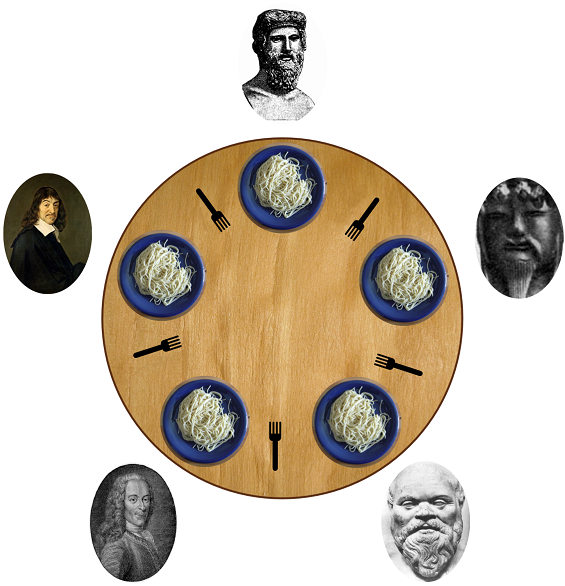

### Классические проблемы многопоточного программирования

#### Видимость


```c++
bool dataReady = false;

void t1() // thread 1
{
    while (!dataReady) continue;
}

void t2() // thread 2
{
    dataReady = true;
}
```

##### Решение проблемы

Использование барьеров памяти и атомарных типов.

```c++
std::atomic<bool> dataReady = false;
```

#### Состояние гонки (race condition)


```c++
void t1() // thread 1
{
    sharedObject->doSomething();
}

void t2() // thread 2
{
    sharedObject->doSomething();
}
```

##### Решение проблемы

1. Локальная копия
2. Синхронизация

##### Локальная копия

```c++
void t1() // thread 1
{
    Object localObject;
    localObject->doSomething();
}
```

##### Синхронизация

```c++
std::mutex mutex;

void t1() // thread 1
{
    std::lock_guard<std::mutex> lock(mutex);
    sharedObject->doSomething();
}
```

#### Взаимная блокировка (deadlock)


```c++
std::mutex m1;
std::mutex m2;

void t1() // thread 1
{
    std::lock_guard<std::mutex> lock1(m1);
    std::lock_guard<std::mutex> lock2(m2);
}

void t2() // thread 2
{
    std::lock_guard<std::mutex> lock1(m2);
    std::lock_guard<std::mutex> lock2(m1);
}
```

##### Решение проблемы

1. Отказ от множественной блокировки
2. Блокировка в одном и том же порядке
3. Одновременная блокировка
4. Иерархии блокировок
5. Алгоритм банкира

##### Блокировка в одном и том же порядке

```c++
void t1() // thread 1
{
    std::lock_guard<std::mutex> lock1(m1);
    std::lock_guard<std::mutex> lock2(m2);
}

void t2() // thread 2
{
    std::lock_guard<std::mutex> lock1(m1);
    std::lock_guard<std::mutex> lock2(m2);
}
```

##### Одновременная блокировка

Иногда дать гарантию на блокировку в одном и том же порядке дать нельзя.

```c++
class Data
{
    std::mutex m_;
public:
    void apply(const Data& data)
    {
        std::lock_guard<std::mutex> lock1(m_);
        std::lock_guard<std::mutex> lock2(data.m_);
        …
    }
};

Data d1;
Data d2;

d1.apply(d2); // thread 1
d2.apply(d1); // thread 2
```

```c++
    void apply(const Data& data)
    {
        std::unique_lock<std::mutex> lock1(m_, std::defer_lock);
        std::unique_lock<std::mutex> lock2(data.m_, std::defer_lock);
        std::lock(lock1, lock2);
        …
    }
```

##### Иерархии блокировок

Установление правила, что некоторые блокировки никогда не могут захватываться в состоянии, в котором уже захвачены какие-то другие блокировки. 

Речь о разработке отношения сравнения между блокировками, и о запрете захвата «большей» блокировки в состоянии, когда уже захвачена «меньшая».

#### Задача об обедающих философах

n философов сидят за столом, перед каждым тарелка с едой, между тарелками лежит по 1 палочке. Чтобы поесть, надо взять 2 палочки, то есть философ должен взять палочку слева и справа от своей тарелки.



1. Философы не вежливые

Философ взял правую палочку и не отдает, левую палочку взял сосед и тоже не отдает - произошла взаимная блокировка (deadlock).

2. Философы вежливые

Философ взял правую палочку, посмотрел, что левая занята соседом, вздохнул, положил правую, подумал о вечном, повторил с начала. Остальные поступают аналогично. Если о вечном все думают одинаковое время, то никто из них не сможет поесть - livelock.

#### Проблема спящего парикмахера

Цель - парикмахер должен работать когда клиенты есть и спать, когда их нет. Клиент прийдя в парикмахерскую, если парикмахер свободен стрижется, если занят, то идет в приемную и там садится на стул и ждет, если свободных стульев нет, то уходит.

Producer–consumer problem - частный случай этой задачи.

```c++
struct Client {};

std::mutex barbershop;
std::condition_variable hasClient;

const size_t ChairsNum = 5;

std::queue<Client> clients;

bool clientCame(Client c)
{
    {
        std::unique_lock<std::mutex> lock(barbershop);

        if (clients.size() == ChairsNum)
            return false;

        clients.push(c);
    }

    hasClient.notify_one();

    return true;
}

void barberThread()
{
    while (true)
    {
        Client c;
        {
            std::unique_lock<std::mutex> lock(barbershop);
            while (clients.empty())
            {
                hasClient.wait(lock);
            }
            c = clients.front();
            clients.pop();
        }
        trim(c);
    }
}
```

#### Задача о читателях-писателях

Есть область памяти, позволяющая чтение и запись. Несколько потоков имеют к ней доступ, при этом одновременно могут читать сколько угодно потоков, но писать — только один. Как обеспечить такой режим доступа?

1. Приоритет читателя

Пока память открыта на чтение, давать читателям беспрепятственный доступ. Писатели могут ждать сколько угодно.

2. Приоритет писателя

Как только появился хоть один писатель, читателей больше не пускать. При этом читатели могут простаивать.

3. Одинаковый приоритет

Независимо от действий других потоков, читатель или писатель должен пройти барьер за конечное время.

##### Стратегии 1 и 2 чреваты голоданием потоков.

> Голодание (starvation) — это более высокоуровневая проблема, чем гонки и взаимоблокировки. Материал для любознательных: [стратегии планирования задач](http://en.wikipedia.org/wiki/Category:Scheduling_algorithms)

#### Решение проблемы

В C++17 в стандарт приняли shared_mutex. Пока можно реализовать желаемое поведение с помощью boost::shared_mutex.

```c++
#include <boost/thread/shared_mutex.hpp>
#include <boost/thread/locks.hpp>

boost::shared_mutex mutex;

void reader()
{
    boost::shared_lock<boost::shared_mutex> lock(mutex);
    // блокируется если есть unique_lock
    // не блокируется, если есть другие shared_lock
}

void conditionalWriter()
{
    boost::upgrade_lock<boost::shared_mutex> lock(mutex);
    // блокируется если есть unique_lock
    // не блокируется, если есть другие shared_lock
    if (something)
    {
        boost::upgrade_to_unique_lock<boost::shared_mutex> uniqueLock(lock);
        // получить эксклюзивный доступ
        // блокируется если есть другие shared_lock
        // при высокой конкуренции на чтение может
        // начаться голодание (starvation)
    }
    // если ни у кого нет экслюзивного доступа
}

void writer()
{
    boost::unique_lock<boost::shared_mutex> lock(mutex);
    // получить эксклюзивный доступ на общих условиях
    // голодания не будет
}
```

#### std::this_thread

```c++
// идентификатор потока
const std::thread::id id = std::this_thread::get_id();

// указание планировщику снять поток с выполнения до следующего раза
std::this_thread::yield();

// усыпить поток на указанное время
std::this_thread::sleep_for(std::chrono::seconds(1))
```

> std::thread::id можно сравнить, можно вывести в поток вывода

#### std::async

```c++
#include <future>

// запуск в отдельном потоке
std::async(std::launc::async, []() { … });

// запуск на усмотрение компилятора, может выполнится в том же потоке
std::async(std::launc::deferred, []() { … });

void doSomething(int x, int y)
{
}

std::async(std::launch::async, doSomething, 5, 7);
```

#### std::future

Ожидание выполнения асинхронной задачи.

```c++
std::future<int> f = 
    std::async(std::launch::async, []() { return 5 });
...
const int result = f.get();
```

```c++
auto f = std::async(std::launch::async, []() { return 5 });
...
f.wait();
```

```c++
auto f = std::async(std::launch::async, []() { return 5 });

auto status = f.wait_for(std::chrono::seconds(1));

if (status == std::future_status::deferred)
    std::cout << "задача еще не стартовала";
else if (status == std::future_status::timeout)
    std::cout << "результата не дождались";
else if (status == std::future_status::ready)
    std::cout << "все готово";
```

#### std::promise

Позволяет получить результат работы из потока.

```c++
#include <future>

std::future<int> runTask()
{
    std::promise<int> promise;
    std::future<int> future = promise.get_future();

    auto task = [](std::promise<int>&& p)
    {
        p.set_value(1);
    };

    std::thread thread(task, std::move(promise));
    thread.detach();

    return future;
}

auto task = runTask();
task.get();
```


#### Исключения в потоке

```c++
void foo()
{
    throw std::runtime_error();
}

std::thread t1(foo);
t1.join();
```

В этом случае поток просто завершиться, об исключении мы не узнаем.

```c++
auto f = std::async(std::launch::async, foo);

try
{
    f.get();
}
catch (const std::runtime_error& error)
{
    // Получили ошибку
}
```

```c++
void foo()
{
    throw std::runtime_error();
}

auto task = ([](std::promise<int>&& p)
{
    try
    {
        foo();
    }
    catch (...)
    {
        p.set_exception(std::current_exception());
    }
}
```

#### std::packaged_task

```c++
std::future<int> runTask()
{
    std::packaged_task<int()> task([]()
    {
        return 1;
    });

    auto future = task.get_future();

    std::thread thread(std::move(task));
    thread.detach();

    return future;
}

auto task = runTask();
task.get();
```

#### std::call_once

Проинициализировать что-либо потокобезопасно один раз.

```c++
std::unique_ptr<Display> display;

void displayThread()
{
    if (!display)
        display.reset(new Display());
    display->show("ok");
}
```
```c++
std::unique_ptr<Display> display;

static std::once_flag displayInitFlag;

void displayThread()
{
    std::call_once(displayInitFlag,
        []() { display.reset(new Display()); });
    display->show("ok");
}
```

#### thread_local

Хранилище уровня потока (с++11).

- Создается когда запускается поток
- Уничтожается когда поток завершает работу
- Для каждого потока свое

```c++
static thread_local std::map<std::string, int> threadCache;
```

### Потокобезопасные интерфейсы

```c++
template <class T>
struct queue
{
    bool empty() const;
    T pop();
};

queue<int> tasks;

if (!tasks.empty())
    process(tasks.pop());
```

```c++
template <class T>
struct threadSafeQueue
{
    bool try_pop(T& value)
    {
        std::lock_guard<std::mutex> lock(mutex);
        if (data_.empty())
            return false;
        value = data_.front();
        data_.pop();
        return true;
    }
};

queue<int> tasks;

Task task;
if (tasks.pop(task))
	process(task);
```

### Семафор своими руками

```c++
class Semaphore
{
    std::mutex mutex_;
    std::condition_variable condition_;
    int counter_;
public:
    explicit Semaphore(int initialValue = 1)
        : counter_(initialValue)
    {
    }

    void enter()
    {
        std::unique_lock<std::mutex> lock(mutex_);
        condition_.wait(lock, [this](){ return counter_ > 0; });
        --counter_;
    }

    void leave()
    {
        std::unique_lock<std::mutex> lock(mutex_);
        ++counter_;
        condition_.notify_one();
    }
};
```

### PingPong

```c++
const int N = 1000000;

Semaphore ping(1);
Semaphore pong(0);

void pingThread()
{
    for (int i = 0; i < N; ++i)
    {
        ping.enter();
        std::cout << "ping" << std::endl;
        pong.leave();
    }
}

void pongThread()
{
    for (int i = 0; i < N; ++i)
    {
        pong.enter();
        std::cout << "pong" << std::endl;
        ping.leave();
    }
}

int main()
{
    std::thread t1(pingThread);
    std::thread t2(pongThread);
    t1.join();
    t2.join();
    return 0;
}
```

EOF