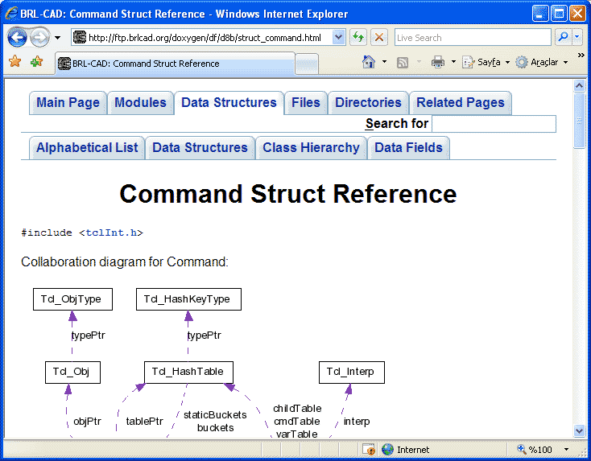

## Арифметика

### Целые отрицательные числа

```
[n][6][5][4][3][2][1][0]
```

##### Диапазон

Верхняя граница:

2^7 = 128

[0, 127]

Нижняя граница:

-(2^7 + 1)

[-128, 0]

```
  -1 == 0b11111111 
-128 == 0b10000000
```

#### std::numeric_limits

```c++
#include <limits>

auto min = std::numeric_limits<int>::min();
auto max = std::numeric_limits<int>::max();
```

#### Переполнение

```c++
uint8_t a = 255;
++a; // overflow
assert(a == 0);
--a; // underflow
assert(a == 255);
```

```c++
int8_t a = 127;
++a;
// ??? - UB
```

Иллюстрация неопределенного поведения:

```c++
#include <iostream>

int main()
{
    int x = 27;
    for(int i=0; i < 10; ++i)
    {
        std::cout << i << " : " << i*1000000000 << " : " << x << std::endl;
        if(x==1) break;
        x = x%2 ? x*3+1 : x/2;
    }
}
```

> Проверено на gcc

#### Приведение знакового к беззнаковому

```c++
int8_t a = -1;
uint32_t b = a;
assert(b == 4294967295);
```

> Результат копирования знакового бита 

#### Сравнение знакового и беззнакового

```c++
uint32_t a = 10;
int32_t b = -1;
assert(a < b); // !!!
```

> Если один из аргументов беззнаковый, то он неявно приводится к знаковому.

### Плавающая точка

> Стандарт IEEE 754


##### float

Одинарная точность

```
32 бита
Порядок (экспонента) 8 бит
Мантисса 23 бита
```

##### double

Двойная точность

```
64 бита
Порядок (экспонента) 11 бит
Мантисса 52 бита
```

#### Специальные значения

##### NaN (not a number)

К операциям, приводящим к появлению NaN в качестве ответа, относятся:

- все математические операции, содержащие NaN в качестве одного из операндов;
- деление нуля на ноль;
- деление бесконечности на бесконечность;
- умножение нуля на бесконечность;
- сложение бесконечности с бесконечностью противоположного знака;
- вычисление квадратного корня отрицательного числа;
- логарифмирование отрицательного числа

> NaN не равен ни одному другому значению (даже самому себе); соответственно, самый простой метод проверки результата на NaN — это сравнение полученной величины с самой собой.

##### Inf (infinity)

Возникает при переполнении.

##### Ноль

Так как в нормализованной форме ноль невозможно представить единственным способом.

#### Сравнение чисел с плавающей точкой на равенство

```c++
double a = 10 / 3.;
double b = a;
const bool isEqual = a == b;
```

```c++
double a = ...;
double b = ...;
const bool isEqual = fabs(a – b) < 0.0001;
```

> Погрешность представления числа увеличивается с ростом самого этого числа

[https://randomascii.wordpress.com/2012/02/25/comparing-floating-point-numbers-2012-edition/](https://randomascii.wordpress.com/2012/02/25/comparing-floating-point-numbers-2012-edition/)

#### Арифметика с массивами чисел с плавющей точкой

> При сложении большого и малого чисел малое просто исчезнет

1. Сортируем массив по возрастанию
2. Получаем сумму от 0 до максимального положительного
3. Получаем сумму от 0 до минимального отрицательного
4. Складываем результаты 2 и 3

### Unicode

##### ASCII


##### ASCII 8


##### KOI8-R


##### Множество кодировок


- Unicode – стандарт, а не кодировка
- CodePoint – символ в таблице Unicode (U+xxxx, где xxxx шестнадцетеричное число, например, U+0410)
- На данный момент уже существует 9 версия стандарта
- Начиная с версии 2.0 кодовая область расширена за пределы 2^16
- В версии 6.0 описано 109 242 графических и 273 прочих символа


[http://www.unicode.org/](http://www.unicode.org/)


### UCS-2

```
H    E    L    L    O
U+0048    U+0065    U+006C  U+006C          U+006F
```

```
00 48 00 65 00 6C 00 6C 00 6F (Big Endian)
    или
48 00 65 00 6C 00 6C 00 6F 00 (Little Endian)
```

### BOM (byte order mark)

##### UTF-8

```
EF BB BF
```

##### UTF-16

```
FE FF (Big Endian)
FF FE (Little Endian)
```

##### UTF-32

```
00 00 FE FF (Big Endian)
FF FE 00 00 (Little Endian)
```

### UTF-16

- Позволяет отобразить 2^20 + 2^16 − 2048 (1 112 064) символов
- Кодирует 0000..D7FF и E000..10FFFF (в виде суррогатных пар)
- Исключенный диапазон D800..DFFF используется как раз для кодирования суррогатных пар
- Суррогатная пара – символ кодируемый двумя 16 битными словами

### UTF-8

Переменное количество байт от 1 до 6
Позволяет закодировать 2^31 CodePoints

|---|---|
|Диапазон символов|Количество байт|
|---|---|
|00000000-0000007F|1|
|00000080-000007FF|2|
|00000800-0000FFFF|3|
|00010000-001FFFFF|4|
|00200000-03FFFFFF|5|
|04000000-7FFFFFFF|6|

### UTF-32, UCS-4

- Кодирует любой символ 4 байтами
- Позволяет индексировать 231 CodePoints
- Символы Юникод непосредственно индексируемы

# Но и это еще не все

### Модифицирующие символы

Графические символы в Юникоде подразделяются на протяжённые и непротяжённые (бесширинные). Непротяжённые символы при отображении не занимают места в строке. К ним относятся, в частности, знаки ударения и прочие диакритические знаки. Как протяжённые, так и непротяжённые символы имеют собственные коды. Протяжённые символы иначе называются базовыми (base characters), а непротяжённые — модифицирующими (combining characters); причём последние не могут встречаться самостоятельно. Например, символ «á» может быть представлен как последовательность базового символа «a» (U+0061) и модифицирующего символа « ́» (U+0301) или как монолитный символ «á» (U+00E1).


### Алгоритмы нормализации

Поскольку одни и те же символы можно представить различными кодами, сравнение строк байт за байтом становится невозможным. Алгоритмы нормализации (normalization forms) решают эту проблему, выполняя приведение текста к определённому стандартному виду. Приведение осуществляется путём замены символов на эквивалентные с использованием таблиц и правил. «Декомпозицией» называется замена (разложение) одного символа на несколько составляющих символов, а «композицией», наоборот, — замена (соединение) нескольких составляющих символов на один символ.

В стандарте Юникода определены 4 алгоритма нормализации текста: NFD, NFC, NFKD и NFKC.

### Что еще?

Например, двунаправленное письмо.

Стандарт Юникод поддерживает письменности языков как с направлением написания слева направо (left-to-right, LTR), так и с написанием справа налево (right-to-left, RTL) – например, арабское и еврейское письмо. В обоих случаях символы хранятся в «естественном» порядке; их отображение с учётом нужного направления письма обеспечивается приложением.

Кроме того, Юникод поддерживает комбинированные тексты, сочетающие фрагменты с разным направлением письма. 


И многое другое...

### ICU

[http://site.icu-project.org/](http://site.icu-project.org/)


## Тестирование

### Разработка через тестирование (Test-driven Development, TDD)

1. Сначала тесты
2. Тесты не проходят – это правильно
3. Написание кода
4. Отладка

В чем выигрыш?

1. Ускорение разработки
2. Покрытие тестами – уверенность при рефакторинге
3. Тесты – это документация которая не устаревает
4. Упрощение портирования кода

### Уровни тестирования

1. Модульное тестирование (unit testing)
2. Интеграционное тестирование (integration testing)
3. Системное тестирование

Модульное тестирование – тестирование минимально возможного компонента, например, функции или метода класса.

Интеграционное тестирование – тестирование программных модулей в группе.

Системное тестирование – тестирование всей системы на соответствие требованиям. Знаний о внутреннем устройстве системы не требует (тестирование черного ящика) – это зона ответственности тестировщиков.

#### Пример модульного теста

```c++
TEST(StreamTest, Test1)
{
  Stream s(“ab”);
  ASSERT_TRUE(s.hasChar());
  ASSERT_EQ(‘a’, s.getChar());
  s.next();
  ASSERT_TRUE(s.hasChar());
  ASSERT_EQ(‘b’, s.getChar());
  s.next();
  ASSERT_FALSE(s.hasChar());
}

TEST(StreamTest, Test2)
{
  Stream s;
  ASSERT_FALSE(s.hasChar());
  s.next();
  ASSERT_FALSE(s.hasChar());
}
```

#### Пример интеграционного теста

```c++
TEST(XmlTokenizerTest, Test1)
{
  Stream source(“<root>5</root>”);

  XmlScanner s(source);

  ASSERT_TRUE(s.hasToken());
  ASSERT_FALSE(s.hasError());
  ASSERT_EQ(‘root’, s.getToken().name());
  ASSERT_EQ(XmlScanner::Token::Tag, s.getToken().type());
}
```

#### Заглушки (mock object)

В предыдущем примере тестирование не представляло проблемы, но как быть, если вместо потока-обертки над строкой, XmlScanner требовал бы открытого файла?

```c++
class InputStream
{
  // Интерфейс
};

class FileStream
  : public InputStream
…

class MockStream
  : public InputStream
…

XmlScanner(InputStream& source);
```

### Google Test

```c++
TEST(имя набора тестов, имя теста в наборе)
{
  ASSERT_TRUE(условие);
  ASSERT_FALSE(условие);
  ASSERT_EQ(ожидаемое, полученное); // ==
  ASSERT_NE(ожидаемое, полученное); // !=
  ASSERT_LT(ожидаемое, полученное);  // <
  ASSERT_LE(ожидаемое, полученное);  // <=
  ASSERT_GT(ожидаемое, полученное);  // >
  ASSERT_GE(ожидаемое, полученное);  // >=
  ASSERT_STREQ(ожидаемое, полученное);
  ASSERT_STRCASEEQ(ожидаемое, полученное);
  ASSERT_NEAR(ожидаемое, полученное, погрешность);
}
```

Для перечисленных проверок есть вариант с префиксом EXPECT вместо ASSERT, разница в том, что ASSERT прерывает текущий тест, а EXPECT версия – нет.

#### Test fixtures

```c++
class TestingContext
  : public ::testing::Test
{
  Context context;
  void SetUp() override { ... } 
  void TearDown() override { ... }
}; 

TEST_F(TestingContext, TestSomething1)
{
  context.doSomething();
}

TEST_F(TestingContext, TestSomething2)
{
}
```

Экземпляр класса TestingContext будет создан для каждого теста, метод SetUp вызван перед тестом, TearDown после.

#### Test fixtures для набора тестов

```c++
class TestingContext
  : public ::testing::Test
{
  static Context context;
  static void SetUpTestCase()  { ... }
  static void TearDownTestCase()  { ... }
  void SetUp() override { ... } 
  void TearDown() override { ... }
}; 

TEST_F(TestingContext, TestSomething1)
{
  context.doSomething();
}

TEST_F(TestingContext, TestSomething2) { ... }
```

SetUpTestCase будет вызван перед первым тестом, TearDownTestCase после последнего. SetUp и TearDown как и раньше до и после каждого теста.

### Что еще можно тестировать?

1. Утечки памяти (memory leak)
2. Нагрузочное тестирование (load)
3. Тестирование стабильности
4. Статический анализ (static program analysis)
5. Деградация производительности

#### Valgrind

Заменяет стандартное выделение памяти своей реализацией отслеживающей корректное ее использование и освобождение. 

Позволяет определить:
- Попытки использования неинициализированной памяти
- Чтение/запись в память после её освобождения
- Чтение/запись за границами выделенного блока
- Утечки памяти

Ограничения:
- Не отслеживает граничные ошибки при использовании статических данных или данных на стеке
- Производительность

#### Статический анализ. CppCheck

Используется для статического анализа кода. Возможности:

1. Проверяет выход за пределы
2. Обнаруживает утечки памяти
3. Обнаруживает возможное разыменовывание NULL-указателей
4. Обнаруживает неинициализированные переменные
5. Обнаруживает неправильное использование STL
6. Проверяет обработку исключительных ситуаций на безопасность
7. Находит устаревшие и неиспользуемые функции
8. Предупреждает о неиспользуемом или бесполезном коде
9. Находит подозрительные участки кода, которые могут содержать в себе ошибки

## Сборка С++ проекта

### Единица трансляции (translation unit)

Минимальный блок исходного текста, который можно преобразовать во внутреннее машинное представление.

**a.cpp**

```c++
#include <vector>
#include “a.h”

...
```

Исходный код a.cpp, плюс все включенные в него файлы – единица трансляции.

```
g++ –o a.o –c a.cpp
```

a.o – результат компиляции, объектный файл (object file).

При изменении любого включенного заголовочного файла потребуется перекомпиляция единицы трансляции!

### Ускорение сборки

В разных единицах трансляции могут использоваться одни и те же заголовочные файлы – это приводит к многократной компиляции одного и того же кода.

Напрашивается идея собрать общие заголовочные файлы в один и скомпилировать их один раз – это предварительно откомпилированные заголовки (precompiled headers):

**stdafx.h**

```c++
#include <vector>
```

**a.cpp**

```c++
#include”stdafx.h” // Всегда первой строкой
#include “a.h”

...
```

При изменении stdafx.h или включенного в него заголовочного файла перекомпилируется весь проект!

### gnu make

```
цель: зависимости
[tab] команда
```

```
CC=g++

all: my_app

my_app: a.o b.o 
  $(CC) -o my_app a.o b.o

a.o: a.cpp
   $(CC) -o a.o -c a.cpp

b.o: b.cpp
   $(CC) -o b.o -c b.cpp

clean: rm -rf *.o my_app
```

### CMake

**CMakeLists.txt**

```
cmake_minimum_required(VERSION 2.8)

project(my_app)

set(SOURCES a.cpp b.cpp)

add_executable(${PROJECT_NAME} ${SOURCES})
```

CMake не собирает проект, он генерирует makefile или проект для IDE. 

Поддерживаются все распространненые платформы и IDE.

```
mkdir build
cd build
cmake ..
```

### Файловая структура проекта

```
-----  bin
   |--  build
   |--  docs
   |     |--  Doxyfile
   |--  include
   |--  resources
   |--  src
   |--  tests
   |     |-- CMakeLists.txt
   |--  CMakeLists.txt
```

##### Включение C++11

```
set(CMAKE_CXX_STANDARD 11)
```

##### Подключение подпроектов

```
add_subdirectory(tests)
```

##### Подключение библиотеки (gtest)

```
set(GTEST_ROOT gtest-1.8.0)
set(BUILD_GTEST ON CACHE BOOL "Builds the googletest subproject")
set(BUILD_GMOCK OFF CACHE BOOL "Builds the googlemock subproject")
add_subdirectory(${GTEST_ROOT} gtest)
include_directories(${GTEST_ROOT}/googletest/include)
```

##### Добавление тестов

```
set(TEST_PROJECT test_my_app)
add_test(NAME ${TEST_PROJECT} COMMAND ${TEST_PROJECT})

add_subdirectory(tests)

enable_testing()

```

##### Сборка Debug или Release

```
сmake .. –DCMAKE_BUILD_TYPE=Debug или Release
```

##### Генераторы

```
сmake .. -G "имя"
```

Полный список:

```
cmake --help
```

### Документирование с Doxygen

Документацию можно писать в коде. Doxygen проанализирует исходный код, построит документацию (html, latex и т.д.) из определений типов и дополнит ее найденными комментариями записанными в специальном формате:

```c++
/** @brief Поиск пользователя в базе данных
     @detailed Данная функция делает выборку из базы данных по имени пользователя и возвращает структуру с информацией о нем. Ожидается, что соединение с базой данных установлено и пользователь существует 
     @param name Имя пользователя 
     @return Информация о пользователе 
     @throw DatabaseError Если произошла ошибка при подключении к базе данных 
     @throw InvalidRequest Если пользоваделя в базе не существует */     

CustomerPtr GetCustomer(const std::string& name);
```

Если установлен Graphviz можно дополнить документацию графом вызовов и диаграммами наследования.



EOF